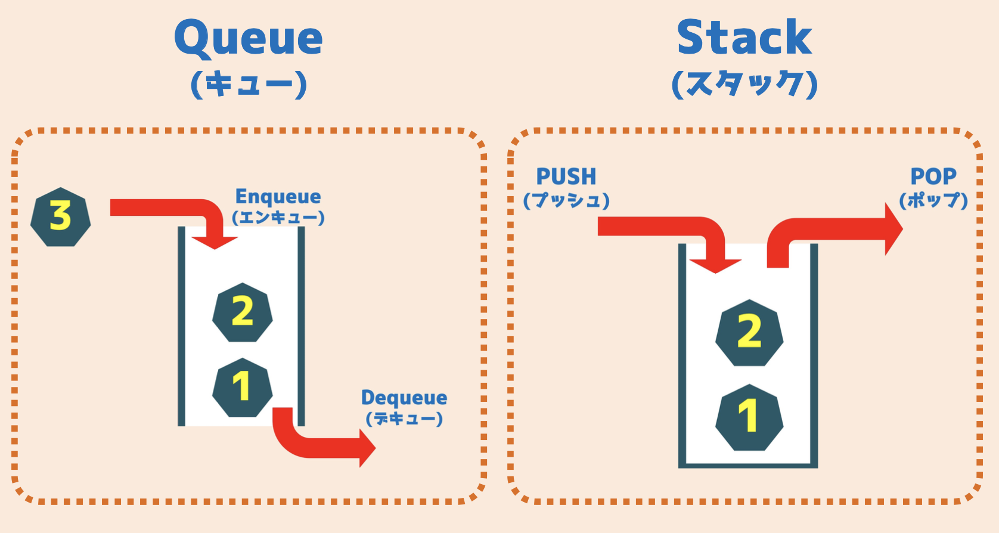

<!-- _class: lead -->

# 迷路で学ぶ<br>探索アルゴリズム入門

幅優先探索（BFS）

---

## 今日のゴール

1. スタートからゴールへ **到達できるか** 調べる
2. ゴールまでの **最短距離** を求める
3. ゴールまでの **最短経路** を復元する

---

## 今日の流れ

|       | 内容                         |
| ----- | ---------------------------- |
| 1     | キューとスタックを理解する   |
| 2     | ミニ演習（動作確認）         |
| 3     | BFS をアニメーションで追う   |
| **4** | **BFS を実装する（メイン）** |
| 5     | 最短距離・到達不能を確認     |
| 6     | 最短経路の復元               |

---

<!-- _class: lead -->

# キューとスタック

---

## スタックとキューのイメージ



---

## キュー

**最初に入れたものから取り出す（FIFO: First In First Out）**

```text
push 1 → push 2 → push 3

[ 1, 2, 3 ]
  ↑ pop（ここから取り出す）

取り出す順: 1 → 2 → 3
```

例え: **レジの行列**

---

## キュー — コード

`deque`（デック）: 先頭から速く取り出せる特別なリスト

**Python**
```python
from collections import deque
que = deque()
que.append(1); que.append(2); que.append(3)
while que:
    print(que.popleft())   # 1, 2, 3
```
**C++**
```cpp
deque<int> que;
que.push_back(1); que.push_back(2); que.push_back(3);
while (!que.empty()) {
    cout << que.front() << '\n';  // 1, 2, 3
    que.pop_front();
}
```

---

## スタック

**最後に入れたものから取り出す（LIFO: Last In First Out）**　例え: **本の積み重ね**

**Python**
```python
st = []
st.append(1); st.append(2); st.append(3)
while st:
    print(st.pop())   # 3, 2, 1
```
**C++**
```cpp
stack<int> st;
st.push(1); st.push(2); st.push(3);
while (!st.empty()) {
    cout << st.top() << '\n';  // 3, 2, 1
    st.pop();
}
```

---

## ミニ演習

`python/2_stack_queue_exercise.py` または `cpp/2_stack_queue_exercise.cpp`

10, 20, 30, 40 を順番に追加して…

**問題 1**: キューで `10 → 20 → 30 → 40` の順に表示する

**問題 2**: スタックで `40 → 30 → 20 → 10` の順に表示する

```text
# 実行方法（Python）
python3 python/2_stack_queue_exercise.py

# 実行方法（C++）
g++ -std=c++17 cpp/2_stack_queue_exercise.cpp && ./a.out
```

---

<!-- _class: lead -->

# 幅優先探索（BFS）

---

## 完成デモ

- スタートからゴールまで **何手** かかるか
- ゴールに **到達できるか**
- 最短経路は **どこを通るか**

<!-- demo/bfs_visualizer.html をブラウザで開く。自動再生（速い）で全体の雰囲気だけ見せる。1手ずつは後で。 -->

---

## 迷路の形式

```text
5 8        ← 高さ H と幅 W
0 0        ← スタート (y, x)
4 7        ← ゴール   (y, x)
S.......   ← (0,0) ← S は位置の目印
.####...
....#...
.##.....
.......G   ← (4,7) ← G は位置の目印
```

- `.` : 通れるマス　　`#` : 壁
- **S・G は説明用の目印**。実際のファイルでは `.` と同じ扱い
- 座標は **0始まり**
- 上下左右の 4 方向に移動、1 移動 = 1 手

---

## BFS のイメージ

スタート `(0, 0)` から **近い順** に調べる

```text
  0 1 2 3
0 0 1 2 3
1 1 # 3 4
2 2 3 4 G
```

- 距離 0 → 1 → 2 → … と波が広がる
- **キューに入れた順 = 近い順** に処理される

---

## アニメーションで確認

<!-- demo/bfs_visualizer.html を 1 手ずつ進める（← → キー）。最初の 10〜15 ステップだけ手で進め、残りは自動再生に切り替える。 -->

確認するポイント:

1. キューにスタートを入れる
2. キューの先頭を取り出す（「今」のマス）
3. 上下左右を確認する
4. 行ける場所を距離付きでキューに追加（「待」のマス）
5. 一度見たマス（数字が入っているマス）は **もう見ない**

---

## なぜキューで最短距離が求まるか

```
キューは先に入れたものから出る
        ↓
近いマスから順番に処理される
        ↓
あるマスに最初に到達したとき = 最短距離
        ↓
一度訪れたマスは二度と調べない
```

---

## BFS の手順（疑似コード）

```text
スタートをキューに入れる

while キューが空ではない:
    現在地をキューから取り出す

    上下左右について:
        次の場所を求める

        迷路の外ならスキップ
        壁ならスキップ
        すでに訪問済みならスキップ

        距離を記録する
        キューに追加する
```

---

<!-- _class: lead -->

# BFS を実装しよう

---

## 上下左右への移動

| 方向 | y の変化 | x の変化 |
| ---- | -------: | -------: |
| 上   |       −1 |        0 |
| 下   |       +1 |        0 |
| 左   |        0 |       −1 |
| 右   |        0 |       +1 |

**Python**
```python
dy = [-1, 1, 0, 0]
dx = [0, 0, -1, 1]

ny = y + dy[i]   # i 番目の方向へ進んだ先
nx = x + dx[i]
```

**C++**
```cpp
int dy[] = {-1, 1, 0, 0};
int dx[] = {0, 0, -1, 1};

int ny = y + dy[i];
int nx = x + dx[i];
```

---

## dy / dx の読み方

`dy[i]` と `dx[i]` は **セットで 1 つの方向** を表す

```text
i=0: dy=-1, dx= 0  →  上
i=1: dy=+1, dx= 0  →  下
i=2: dy= 0, dx=-1  →  左
i=3: dy= 0, dx=+1  →  右
```

`for i in range(4):` のループ 1 つで 4 方向を網羅できる

---

## y は下向きが +1

迷路の **行番号** がそのまま y — 下ほど大きい

```text
y=0  ........
y=1  .####...
y=2  ....#...
y=3  .##.....
y=4  ........
     x→
```

「上に進む = y が減る」に注意！

---

## 迷路の外に出ていないか確認

移動先が迷路の外になることがある（配列インデックスが −1 や H/W 以上になる）。**壁チェックより先に行う**

**Python**
```python
if not (0 <= ny < H and 0 <= nx < W):
    continue
```

**C++**
```cpp
if (ny < 0 || ny >= H ||
    nx < 0 || nx >= W) {
    continue;
}
```

---

## キューに座標を入れる

**Python**
```python
que.append((y, x))       # 追加
y, x = que.popleft()     # 先頭を取り出す
```

**C++**
```cpp
deque<pair<int, int>> que;  // pair: 2つの整数をセットにする型

que.push_back({y, x});           // 追加

auto [y, x] = que.front();       // 先頭を y と x に分解して取り出す
que.pop_front();
```

---

## TODO を埋めよう

`python/3_bfs_template.py` / `cpp/3_bfs_template.cpp`

| TODO | 内容                       |
| ---- | -------------------------- |
| 1    | キューから現在地を取り出す |
| 2    | 次の座標を求める           |
| 3    | 迷路の外ならスキップ       |
| 4    | 壁ならスキップ             |
| 5    | 訪問済みならスキップ       |
| 6    | 距離を記録する             |
| 7    | キューに追加する           |

正解の出力 → **`最短距離: 11`**

---

## 最短距離を確認する

BFS が終わったら `dist[gy][gx]` を確認する

**Python**
```python
answer = dist[gy][gx]

if answer == -1:
    print("ゴールには到達できません")
else:
    print("最短距離:", answer)
```

**C++**
```cpp
int answer = dist[gy][gx];

if (answer == -1) {
    cout << "ゴールには到達できません\n";
} else {
    cout << "最短距離: " << answer << '\n';
}
```

- `-1` のまま → 到達できない
- `0 以上` → その値が最短距離

---

## 到達できない迷路

`maze05_unreachable.txt`

```text
.......
#######
.......
#######
.......
```

スタート `(0, 0)` → ゴール `(4, 6)`

キューが空になれば BFS は必ず止まる  
**到達不能用の特別な処理は要らない**

---

## 経路を復元する

BFS のとき、**どこから来たか** を各マスに記録しておく

```python
py = [[-1] * W for _ in range(H)]   # どの y 座標から来たか
px = [[-1] * W for _ in range(H)]   # どの x 座標から来たか

# BFS の中で、隣のマスへ進むときに記録する
py[ny][nx] = y
px[ny][nx] = x
```

---

## 経路を復元する（続き）

ゴールから逆にたどると最短経路がわかる

```python
result = [list(line) for line in maze]  # 迷路のコピー（印をつけるため）

y, x = gy, gx
while (y, x) != (sy, sx):
    result[y][x] = "*"
    y, x = py[y][x], px[y][x]
```

```text
S.......
*####...
*...#...
*##.....
*******G
```

→ 完全な実装は `answers/3_bfs_path_answer.*`

---

## 別の迷路で試す

`mazes/` フォルダの迷路ファイルを stdin から渡す

```text
# Python
python3 answers/3_bfs_answer.py < mazes/maze04.txt

# C++（プロジェクトルートから）
g++ -std=c++17 cpp/answers/3_bfs_answer.cpp -o bfs_answer
./bfs_answer < mazes/maze04.txt
```

| ファイル                 | 特徴                         |
| ------------------------ | ---------------------------- |
| `maze04.txt`             | 少し複雑                     |
| `maze05_unreachable.txt` | 到達不能                     |
| `maze11_detour.txt`      | 見た目 14 手、実際 **30 手** |

---

## DFS（深さ優先探索）

**行けるところまで深く進み、行き止まりで戻る**

```text
スタックにスタートを入れる

while スタックが空ではない:
    現在地をスタックから取り出す
    上下左右について:
        行ける場所をスタックに追加
```

- BFS の「キュー」を **スタック** に替えるだけで実装できる
- 到達できるか: **調べられる**
- 最短距離: **求まらない**（先に見つけた経路が最短とは限らない）

---

## DFS と BFS の違い

|            | BFS（幅優先） | DFS（深さ優先） |
| ---------- | ------------- | --------------- |
| データ構造 | キュー        | スタック / 再帰 |
| 探索の順番 | 近い順        | 深い方向へ進む  |
| 最短距離   | **求まる**    | 求まらない      |
| 到達確認   | できる        | できる          |

最短距離が欲しいときは **BFS**

---

## BFS の応用

同じ考え方がいろんな場面で使える

- ゲームのマップ探索
- SNS のつながり（○度の知り合い）
- ネットワークの経路探索
- パズルの最短手数

---

<!-- _class: lead -->

# おつかれさまでした！
